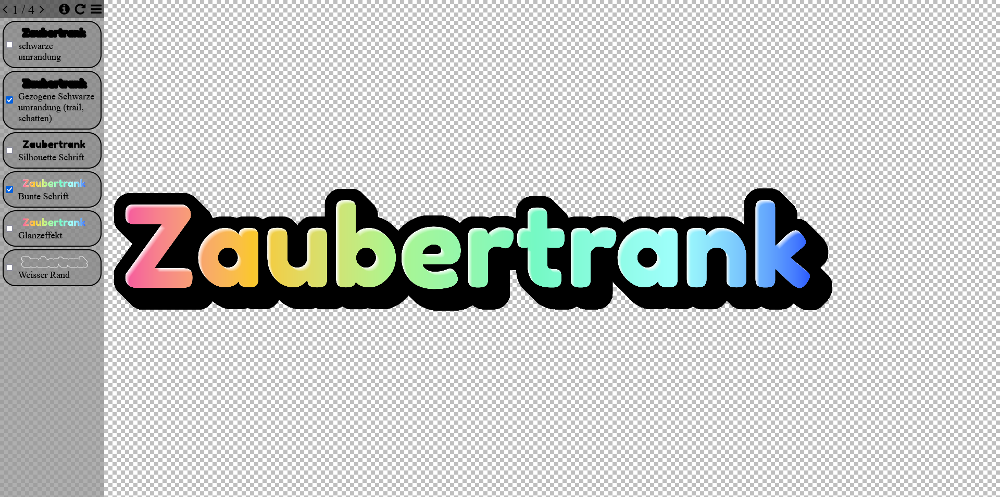

# Show [paint.net](https://getpaint.net/) projects in a browser.

This project renders the output of [pdnexport](https://gitlab.com/christianbrinkmann/pdnexport) python script in a browser.

## Installation

1. Clone pdnexport repo
2. Export one or multiple .pdn project files using pdnexport to a path available on web (somewhere like /var/www/paint/data if you're running a linux based server)
3. Clone this repository to the folder containing the exported data directory (like /var/www/paint)
   Example:
```bash
root@cloud:~# ls /var/www/christian-f-brinkmann/paint/ -l
insgesamt 116
drwxr-xr-x 82 cloud cloud  4096 19. Feb 00:35 data
-rw-r--r--  1 root  root  57158 28. Aug 2022  drawCanvas.js
-rw-r--r--  1 root  root   4434 26. Aug 2022  index.html
drwxr-xr-x  4 root  root   4096 21. Aug 2022  lib
-rw-r--r--  1 root  root   1079 21. Aug 2022  LICENSE.md
-rw-r--r--  1 cloud cloud  1298 26. Aug 2022  loading_bar.css
drwxr-xr-x  2 root  root   4096 23. Aug 2022  old
drwxr-xr-x  2 root  root   4096 21. Aug 2022  python
-rw-r--r--  1 root  root   1434 21. Aug 2022  README.md
drwxr-xr-x  2 root  root   4096 21. Aug 2022  res
drwxr-xr-x  2 root  root   4096 21. Aug 2022  screenshots
-rw-r--r--  1 cloud cloud  6665 26. Aug 2022  style.css
-rw-r--r--  1 root  root    155 23. Aug 2022  webgl.html
-rw-r--r--  1 root  root     85 23. Aug 2022  webgl.js
```

## Usage

Specify the name(s) of the files you want to show in the path using `?id=abcd&id=cdef` (replace `abcd` and `cdef` with actual project file names).

So in our example, if your domain were `example.com` then you should open
`example.com/paint/?id=abcd&id=cdef`

## Demo

It looks something like this:



A screenshot might be nice, but there's nothing better than just trying it out yourself at my [website](https://christian-f-brinkmann.de/paint/?id=Zaubertrank%20logo&id=testimage&id=singlecolor&id=Windows%20Mac%20Linux%20Logo%202025).

## Embedding

It is possible to embed the webview into another website like this:
```
<iframe id="pdnview" src="https://christian-f-brinkmann.de/paint/?id=Zaubertrank%20logo&id=testimage" title="Paint.net projects"
		style='width: 1280px; height: 720px; border: none; overscroll-behavior: contain ;' allowfullscreen></iframe> 
```
